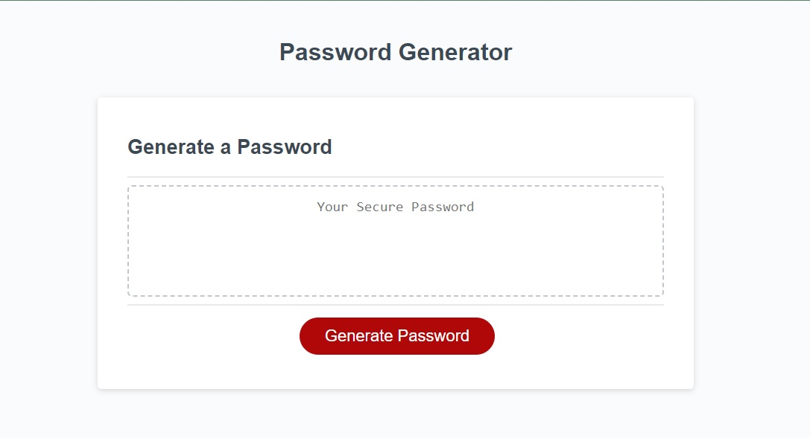
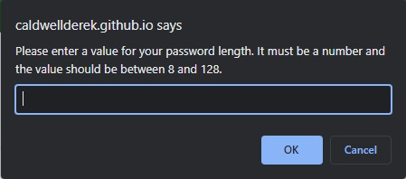
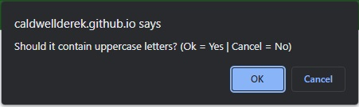
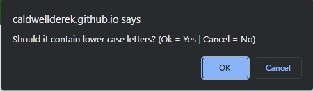
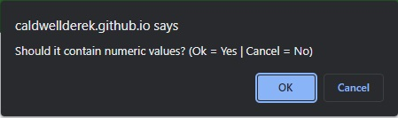
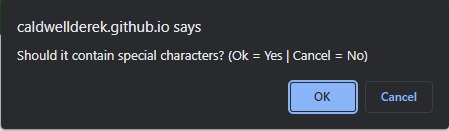
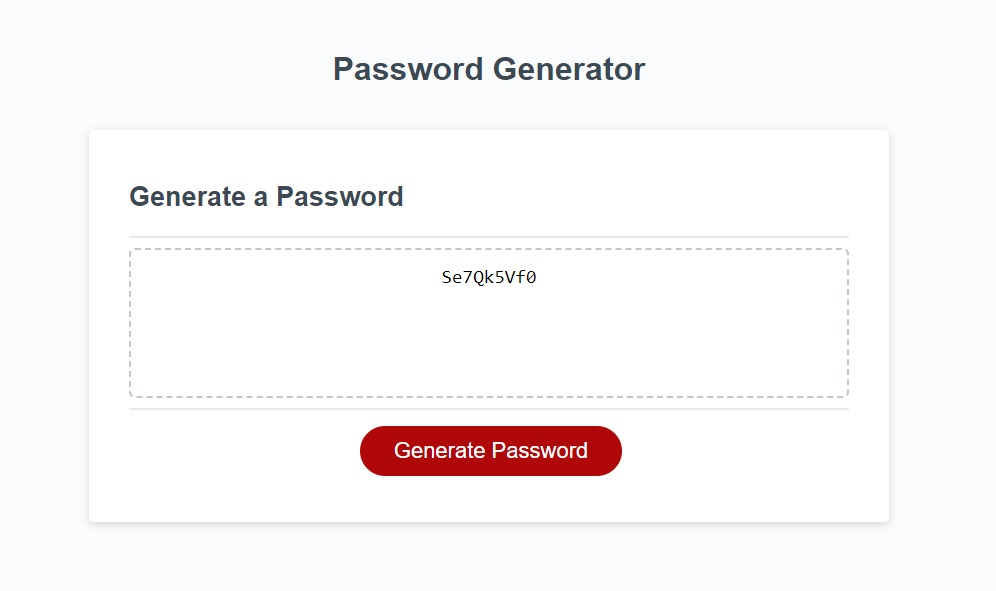

# Password Generator

## Table of Contents
1. [Description](#description)
2. [Installation](#installation)
3. [Usage](#usage)
4. [Contributing](#contributing)
5. [Tests](#tests)
6. [License](#license)
7. [Questions](#questions)
8. [Media](#media)

## Description
The motivation behind this project was to demonstrate understanding of Javascript and how it can be used to interact with HTML / CSS via the DOM. Here, the HTML button 'Generate Password' responds to an event listener and displays a series of prompts to determine a suitable password based off of the user's chosen criteria.

## Installation
No installation necessary for this application, the tool can be accessed at the deployed website: https://caldwellderek.github.io/password-generator/

## Usage
Quickly generate a strong password by responding to the prompts with which password criteria you want

## Contributing
This project is open source, anyone may use or contribute to it.

## Tests
No test suites were performed on this application at the time.

## License
This application is currently covered under the MIT License. More information about this license can be viewed under the file named 'LICENSE' in the repository.

## Questions
If you have any questions, feel free to reach out to me at my email: djohncaldwell@gmail.com

All of my work can be viewed at my GitHub profile: [CaldwellDerek](https://github.com/CaldwellDerek)

## Media
---
Starting Page\

---
First Prompt\

---
Second Prompt\

---
Third Prompt\

---
Fourth Prompt\

---
Fifth Prompt\

---
Resulting Page\
